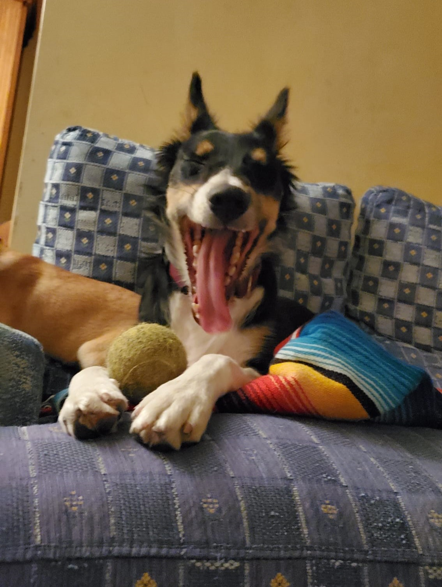

# Jairo Tecles

## Informació bàsica:
- **Població:** Alfafara
- **Data de naixement:** 23 de Febrer de 2005
- **Altres dades d'interès:**
  - Aficions: Viatjar, programació, pelicules
  - Idiomes: Castellà, Valencià, Anglès


## Imatge Avatar:




## Descripció personal:

Sóc un estudiant **apassionat per la tecnologia** i la programació. Vaig estudiar el **Cicle mitjà de SMX** i actualment estic estudiant **Cicle superior de DAW Semipresencial**. M'agradaria especialitzar-me en el camp del **desenvolupament d'intel·ligència artificial** perquè crec que és una àrea amb molt de futur. 

*Quan acabe el cicle, m'agradaria treballar en una empresa tecnològica innovadora* on puga créixer com a desarrollador i seguir aprenent coses noves.

## Habilitats
  
Habilitat         | Nivell        
------------------|:----------------:
Programació       | Avançat       
CI-CD i DevOps    | Intermedi
SQL               | Intermedi
Disseny Gràfic    | Bàsic

## Perfil

La meua [pàgina web personal](https://4jairo.tech) es un portfoli interactiu on mostre projectes amb diferentes tecnologies en els quals he treballat.

<https://4jairo.tech>

Al meu perfil de github, també hi ha algun projecte

<https://github.com/4jairo>

## Professions desitjades:

1. Desenvolupador Back-end
2. Analista de dades
3. Administrador de bases de datos
4. Professor de programació

## Frase inspiradora

> "Es simple: solo haz que pase". Didier Diderot.


## Exemple de codi en Go:

```go
package main

import "fmt"

func main() {
    fmt.println("Saludos!!")
}
```